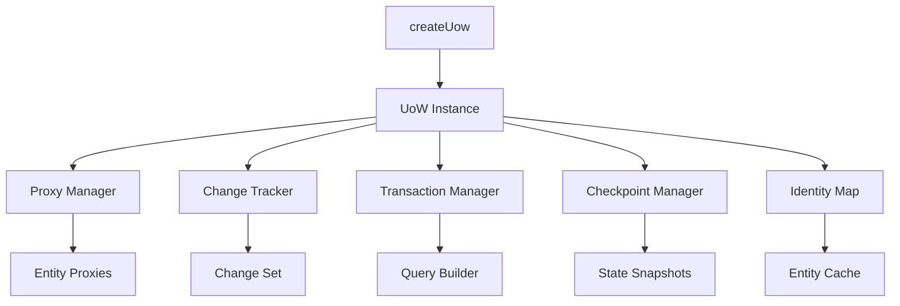

# System Patterns: drizzle-uow

## Architecture Overview

### Core Components



### Key Design Patterns

#### 1. Proxy Pattern for Change Tracking
```typescript
// Proxy wraps entities to intercept property changes
const entityProxy = new Proxy(originalEntity, {
  set(target, property, value) {
    // Track the change
    changeTracker.recordChange(target, property, value);
    // Update the target
    target[property] = value;
    return true;
  }
});
```

**Benefits:**
- Transparent change tracking
- No modification to entity classes
- Works with plain JavaScript objects

#### 2. Repository Pattern Extension
```typescript
// Each table gets a repository-like interface
uow.users.findFirst()  // Drizzle query, proxy-wrapped result
uow.users.create()     // New entity creation with tracking
uow.users.delete()     // Mark entity for deletion
```

**Integration:**
- Extends Drizzle's query API
- Adds UoW-specific methods (create, delete)
- Maintains type safety

#### 3. Unit of Work Pattern
```typescript
// Central coordination of changes
class UnitOfWork {
  private changes: Map<Entity, ChangeSet>;
  private newEntities: Set<Entity>;
  private deletedEntities: Set<Entity>;
  private identityMap: IdentityMap;
  
  async save(checkpoint?: number) {
    // Build and execute queries in transaction
    // Optionally save only up to specified checkpoint
  }
}
```

**Responsibilities:**
- Track all entity states
- Coordinate database operations
- Manage transaction boundaries
- Ensure entity uniqueness via identity map

#### 4. Identity Map Pattern
```typescript
// Ensures single instance per entity identity
class IdentityMap {
  private entities: Map<string, Map<any, Entity>>;
  
  get(table: string, id: any): Entity | undefined {
    return this.entities.get(table)?.get(id);
  }
  
  register(table: string, id: any, entity: Entity): void {
    if (!this.entities.has(table)) {
      this.entities.set(table, new Map());
    }
    this.entities.get(table)!.set(id, entity);
  }
  
  remove(table: string, id: any): void {
    this.entities.get(table)?.delete(id);
  }
}
```

**Benefits:**
- Prevents duplicate entity instances
- Ensures consistency across references
- Improves performance by caching
- Simplifies relationship management

## Technical Implementation Details

### Change Tracking Strategy

#### Entity State Management
```typescript
enum EntityState {
  Unchanged,
  Modified,
  Added,
  Deleted
}

interface TrackedEntity {
  entity: any;
  state: EntityState;
  originalValues: Map<string, any>;
  currentValues: Map<string, any>;
}
```

#### Deep Proxy Implementation
- Handle nested objects
- Track array modifications
- Preserve object identity
- Handle circular references

### Database Adapter Pattern

```typescript
interface DatabaseAdapter<TDatabase> {
  beginTransaction(): Promise<Transaction>;
  executeQueries(queries: Query[]): Promise<void>;
  commitTransaction(tx: Transaction): Promise<void>;
  rollbackTransaction(tx: Transaction): Promise<void>;
}

// Implementations for each database type
class PostgresAdapter implements DatabaseAdapter<PostgresDatabase> {}
class MySQLAdapter implements DatabaseAdapter<MySQLDatabase> {}
class SQLiteAdapter implements DatabaseAdapter<SQLiteDatabase> {}
```

### Type System Architecture

#### Generic Type Flow
```typescript
// Preserve Drizzle's type inference
type UoWDatabase<TSchema> = {
  [K in keyof TSchema]: UoWTable<TSchema[K]>
} & UoWMethods;

// Wrap table methods
type UoWTable<TTable> = {
  // Drizzle methods return proxied results
  findFirst(): Promise<Proxied<InferSelect<TTable>>>;
  findMany(): Promise<Proxied<InferSelect<TTable>>[]>;
  
  // UoW-specific methods
  create(data: InferInsert<TTable>): Proxied<InferSelect<TTable>>;
  delete(entity: InferSelect<TTable>): void;
}
```

### Query Building Strategy

#### Change Set to Query Conversion
```typescript
interface ChangeSetProcessor {
  // Convert tracked changes to SQL operations
  processInserts(entities: TrackedEntity[]): InsertQuery[];
  processUpdates(entities: TrackedEntity[]): UpdateQuery[];
  processDeletes(entities: TrackedEntity[]): DeleteQuery[];
  
  // Optimize query order for constraints
  orderQueries(queries: Query[]): Query[];
}
```

#### Batch Optimization
1. Group similar operations
2. Respect foreign key constraints
3. Minimize round trips
4. Use bulk operations where available

### Checkpoint System Design

```typescript
interface Checkpoint {
  id: number;
  timestamp: number;
  entityStates: Map<Entity, EntitySnapshot>;
  identityMapSnapshot: Map<string, Map<any, Entity>>;
}

class CheckpointManager {
  private checkpoints: Checkpoint[] = [];
  private currentCheckpoint: number = 0;
  
  setCheckpoint(): number {
    // Snapshot current state including identity map
    const checkpoint: Checkpoint = {
      id: ++this.currentCheckpoint,
      timestamp: Date.now(),
      entityStates: this.captureEntityStates(),
      identityMapSnapshot: this.captureIdentityMap()
    };
    this.checkpoints.push(checkpoint);
    return checkpoint.id;
  }
  
  rollback(checkpointId: number): RollbackResult {
    // Restore entity states and identity map
    const checkpoint = this.checkpoints.find(cp => cp.id === checkpointId);
    if (!checkpoint) {
      return { error: "Checkpoint not found" };
    }
    this.restoreEntityStates(checkpoint.entityStates);
    this.restoreIdentityMap(checkpoint.identityMapSnapshot);
    return { error: null };
  }
  
  getChangesUpToCheckpoint(checkpointId: number): ChangeSet[] {
    // Get all changes up to specified checkpoint for selective saving
  }
}
```

## Error Handling Patterns

### Transaction Rollback
- Automatic rollback on errors
- Preserve original entity states
- Clear error reporting

### Validation Strategy
- Pre-save validation hooks
- Schema validation integration
- Custom business rule validation

## Performance Optimizations

### Lazy Proxy Creation
- Create proxies on-demand
- Cache proxy instances
- Minimize overhead for read-only operations

### Change Detection Optimization
- Dirty checking only on modified entities
- Efficient diff algorithms
- Skip unchanged properties

### Memory Management
- Weak references for entity tracking
- Cleanup after save operations
- Configurable history limits

## Integration Patterns

### With Existing Drizzle Code
```typescript
// Can mix UoW and direct Drizzle usage
const directResult = await db.select().from(users);
const uowResult = await uow.users.findMany();

// UoW aware of external changes via refresh
await uow.refresh(entity);
```

### Migration Path
1. Wrap existing Drizzle instance
2. Gradually adopt UoW patterns
3. Keep direct access for special cases

## Security Patterns

### Input Sanitization
- Leverage Drizzle's built-in protections
- No raw SQL construction
- Parameterized queries only

### Access Control Hooks
- Pre-save authorization checks
- Entity-level permissions
- Audit trail integration

## Testing Patterns

### Unit Testing
- Mock proxy behavior
- Test change tracking logic
- Verify query generation

### Integration Testing
- Real database transactions
- Multi-database compatibility
- Concurrency scenarios

### Type Testing
```typescript
// Ensure type preservation
expectType<User>(await uow.users.findFirst());
expectType<User>(uow.users.create({ name: "test" }));
